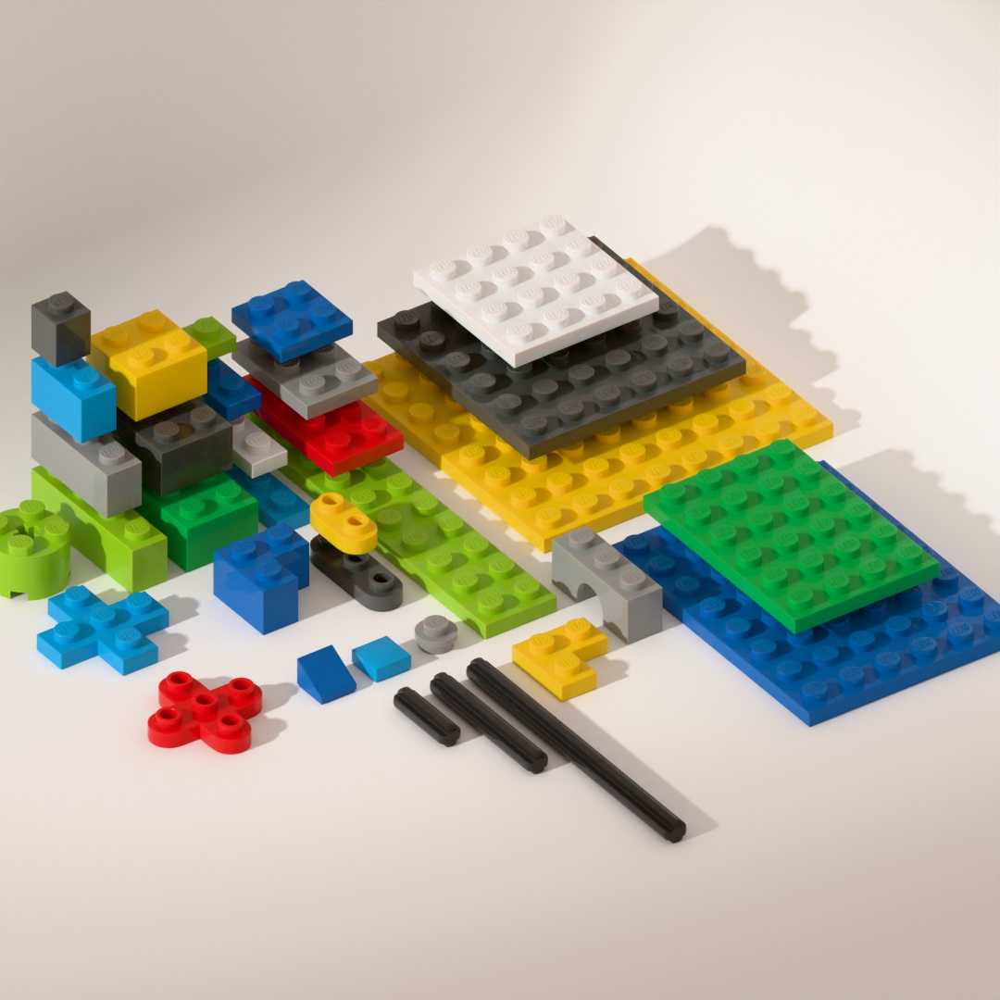

LEGO Kit for Blender
====================

Reasonably accurate recreations of some LEGO bricks in Blender.

The pieces are constructed using quads. This enables subdivision surfaces to be applied allowing for very high resolution results.

## Scripts

Two scripts are included in the file:

- "Nine Tile Expander" installs on the N-panel in a "DPT" tab. Run it to take a collection of nine tiles and expand them out. Use this to quickly build new pieces (nine tiles for plates included).
- "Sync Mesh Names" installs in the same tab. Run it to synchronise all mesh names with their parent objects.

## Disclaimer

This file is provided for personal, non-commercial, use. It is not sponsored or authorised by the LEGO Group.
